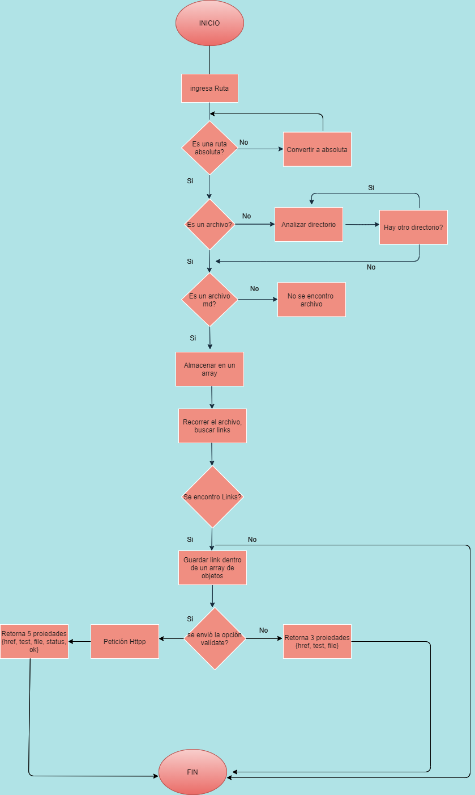

#  Libreria Markdown Links

Este proyecto presenta una libreria que verifica las links dentro de cada archivo con extensión ".md" (markdown)
y permite validar dichos links y realizar algunas estadisticas.

La librería esta implementada en JavaScript para ser ejecutada con Node.js.

## Necesidad del usuario:

Instalar la libreria via npm install --global KatyLuHT/LIM013-fe-md-links

### Modulos utilizados
  Implementa los modulos de node.js:

  - fs
  - path
  - console

## Lenguaje utilizado
    El código está escrito en lenguaje de javascript.

## Pruebas unitarias
    Para las pruebas unitarias se utilizó Jest.

## Instalación
    Usando npm (una vez que ya has instalado node.js)

## **Diagramas de Flujo**

## Objetivos de aprendizaje

Diseñar tu propia librería es una experiencia fundamental para cualquier
desarrollador porque que te obliga a pensar en la interfaz (API) de tus
_módulos_ y cómo será usado por otros developers. Debes tener especial
consideración en peculiaridades del lenguaje, convenciones y buenas prácticas.

A continuación puedes ver los objetivos de aprendizaje de este proyecto:

### JavaScript

* [ ] Uso de condicionales (if-else | switch | operador ternario)
* [ ] Uso de funciones (parámetros | argumentos | valor de retorno)
* [ ] Manipular arrays (filter | map | sort | reduce)
* [ ] Manipular objects (key | value)
* [ ] Uso ES modules ([`import`](https://developer.mozilla.org/en-US/docs/Web/JavaScript/Reference/Statements/import)
| [`export`](https://developer.mozilla.org/en-US/docs/Web/JavaScript/Reference/Statements/export))
* [ ] Diferenciar entre expression y statements.
* [ ] Diferenciar entre tipos de datos atómicos y estructurados.
* [ ] [Uso de callbacks.](https://developer.mozilla.org/es/docs/Glossary/Callback_function)
* [ ] [Consumo de Promesas.](https://scotch.io/tutorials/javascript-promises-for-dummies#toc-consuming-promises)
* [ ] [Creación de Promesas.](https://www.freecodecamp.org/news/how-to-write-a-javascript-promise-4ed8d44292b8/)

### Node

* [ ] Uso de sistema de archivos. ([fs](https://nodejs.org/api/fs.html), [path](https://nodejs.org/api/path.html))
* [ ] Instalar y usar módulos. ([npm](https://www.npmjs.com/))
* [ ] Creación de modules. [(CommonJS)](https://nodejs.org/docs/latest-v0.10.x/api/modules.html)
* [ ] [Configuración de package.json.](https://docs.npmjs.com/files/package.json)
* [ ] [Configuración de npm-scripts](https://docs.npmjs.com/misc/scripts)
* [ ] Uso de CLI (Command Line Interface - Interfaz de Línea de Comando)

### Testing

* [ ] [Testeo unitario.](https://jestjs.io/docs/es-ES/getting-started)
* [ ] [Testeo asíncrono.](https://jestjs.io/docs/es-ES/asynchronous)
* [ ] [Uso de librerias de Mock.](https://jestjs.io/docs/es-ES/manual-mocks)
* [ ] Uso de Mocks manuales.
* [ ] Testeo para múltiples Sistemas Operativos.

### Estructura del código y guía de estilo

* [ ] Organizar y dividir el código en módulos (Modularización)
* [ ] Uso de identificadores descriptivos (Nomenclatura | Semántica)
* [ ] Uso de linter (ESLINT)

### Git y GitHub

* [ ] Uso de comandos de git (add | commit | pull | status | push)
* [ ] Manejo de repositorios de GitHub (clone | fork | gh-pages)
* [ ] Colaboración en Github (branches | pull requests | |tags)
* [ ] Organización en Github (projects | issues | labels | milestones)

### HTTP

* [ ] Verbos HTTP ([http.get](https://nodejs.org/api/http.html#http_http_get_options_callback))

### Fundamentos de programación

* [ ] [Recursión.](https://www.youtube.com/watch?v=lPPgY3HLlhQ)
